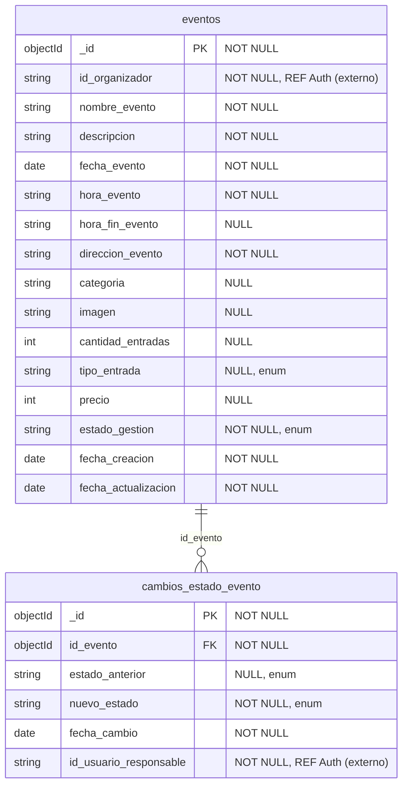

# Diagrama Entidad-Relación y Diccionario de Datos

Generado automáticamente desde la base de datos `panel_organizador` el `2026-10-01T23:41:21.001Z` con `database/scripts/generate-docs.mjs`.

## Diagrama Entidad-Relación

> Archivo vectorial complementario: [`diagrama-er.svg`](diagrama-er.svg)

---

# Diccionario de Datos

## Colección: `eventos`

Eventos creados y administrados por organizadores en el Panel Organizador. Fuente de verdad de los datos generales del evento para Catálogo, Entradas, Check-in, Notificaciones y Promociones.

| Campo | Tipo | Nulo | Clave | Restricciones | Descripción |
|---|---|---|---|---|---|
| _id | objectId | NO | PK |  | [PK] Identificador único del evento. Se expone en la API como id_evento (string). |
| id_organizador | string | NO | REF | minLength: 1 | [REF Auth.usuario.id_usuario] Organizador dueño del evento. Sólo se guarda el identificador; los datos personales viven en Auth. |
| nombre_evento | string | NO |  | minLength: 3; maxLength: 120 | Nombre público del evento. |
| descripcion | string | NO |  | minLength: 1; maxLength: 2000 | Descripción del evento mostrada en Catálogo. |
| fecha_evento | date | NO |  |  | Día en que se realiza el evento (medianoche UTC del día calendario). |
| hora_evento | string | NO |  | pattern: ^([01][0-9]|2[0-3]):[0-5][0-9]$ | Hora de inicio en formato HH:mm (America/Santiago). |
| hora_fin_evento | string | SI |  | pattern: ^([01][0-9]|2[0-3]):[0-5][0-9]$ | Hora de término en formato HH:mm (America/Santiago). Si es menor o igual que hora_evento, el evento termina al día siguiente. Obligatoria para publicar (contrato Check-in v1.2). |
| direccion_evento | string | NO |  | minLength: 3; maxLength: 200 | Dirección o ubicación donde se realiza el evento. |
| categoria | string | SI |  | maxLength: 50 | Categoría del evento usada por Catálogo para filtrar. |
| imagen | string | SI |  |  | URL de la imagen del evento. |
| cantidad_entradas | int | SI |  | min: 1; max: 100000 | Cantidad inicial de entradas habilitadas. La gestión del stock corresponde a Entradas. |
| tipo_entrada | string (enum) | SI |  | enum: GRATUITA, PAGADA | Indica si las entradas del evento son gratuitas o pagadas. |
| precio | int | SI |  | min: 0; max: 10000000 | Precio de la entrada en pesos chilenos (CLP), máximo 10.000.000. 0 o nulo si es gratuita. |
| estado_gestion | string (enum) | NO |  | enum: BORRADOR, PUBLICADO, FINALIZADO, CANCELADO | Estado administrativo del evento. Todo evento nace en BORRADOR. |
| fecha_creacion | date | NO |  |  | Fecha y hora de creación del registro. |
| fecha_actualizacion | date | NO |  |  | Fecha y hora de la última modificación del registro. |

### Índices

| Nombre | Campos | Propósito |
|---|---|---|
| _id_ | _id | PK (índice automático de MongoDB) |
| ix_eventos_organizador_fecha | id_organizador, fecha_evento | HU-05: listar los eventos de un organizador ordenados por fecha |
| ix_eventos_estado_fecha | estado_gestion, fecha_evento | Catálogo/Promociones: eventos PUBLICADO por fecha |

---

## Colección: `cambios_estado_evento`

Historial de cambios de estado de gestión de cada evento. Origen de los datos 'nuevo estado' y 'fecha de cambio' que consume Notificaciones.

| Campo | Tipo | Nulo | Clave | Restricciones | Descripción |
|---|---|---|---|---|---|
| _id | objectId | NO | PK |  | [PK] Identificador único del cambio de estado. |
| id_evento | objectId | NO | FK |  | [FK eventos._id] Evento cuyo estado cambió. |
| estado_anterior | string (enum) | SI |  | enum: BORRADOR, PUBLICADO, FINALIZADO, CANCELADO | Estado previo al cambio. Nulo en el registro de creación. |
| nuevo_estado | string (enum) | NO |  | enum: BORRADOR, PUBLICADO, FINALIZADO, CANCELADO | Estado resultante del cambio. |
| fecha_cambio | date | NO |  |  | Fecha y hora en que ocurrió el cambio de estado. |
| id_usuario_responsable | string | NO | REF | minLength: 1 | [REF Auth.usuario.id_usuario] Usuario que ejecutó el cambio. |

### Índices

| Nombre | Campos | Propósito |
|---|---|---|
| _id_ | _id | PK (índice automático de MongoDB) |
| ix_cambios_evento_fecha | id_evento, fecha_cambio | Notificaciones: historial de estados de un evento, más reciente primero |

---

## Convenciones de nomenclatura
- Colecciones en snake_case plural y en español.
- Campos snake_case en español, iguales a los contratos.
- `id_<entidad>` para identificadores.
- `fecha_*` para fechas.
- enums en MAYÚSCULAS.
