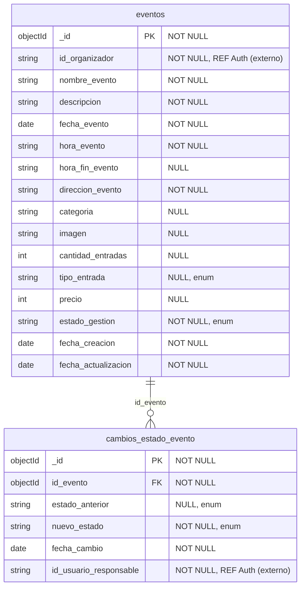

Generado automáticamente desde la base de datos `panel_organizador` el `2026-09-30T23:30:59.969Z` con `database/scripts/generate-docs.mjs`

```mermaid
erDiagram
  eventos {
    objectId _id PK "NOT NULL"
    string id_organizador "NOT NULL, REF Auth (externo)"
    string nombre_evento "NOT NULL"
    string descripcion "NOT NULL"
    date fecha_evento "NOT NULL"
    string hora_evento "NOT NULL"
    string hora_fin_evento "NULL"
    string direccion_evento "NOT NULL"
    string categoria "NULL"
    string imagen "NULL"
    int cantidad_entradas "NULL"
    string tipo_entrada "NULL, enum"
    int precio "NULL"
    string estado_gestion "NOT NULL, enum"
    date fecha_creacion "NOT NULL"
    date fecha_actualizacion "NOT NULL"
  }
  cambios_estado_evento {
    objectId _id PK "NOT NULL"
    objectId id_evento FK "NOT NULL"
    string estado_anterior "NULL, enum"
    string nuevo_estado "NOT NULL, enum"
    date fecha_cambio "NOT NULL"
    string id_usuario_responsable "NOT NULL, REF Auth (externo)"
  }
  eventos ||--o{ cambios_estado_evento : "id_evento"
```
