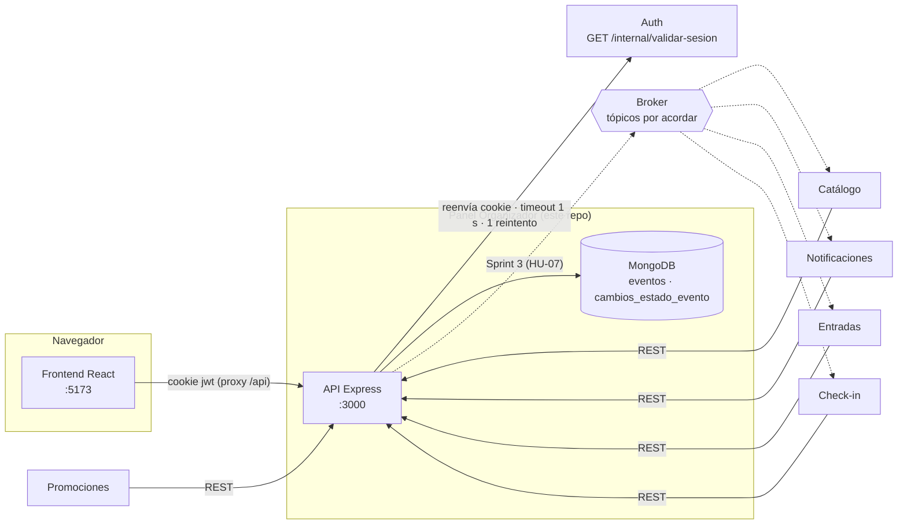
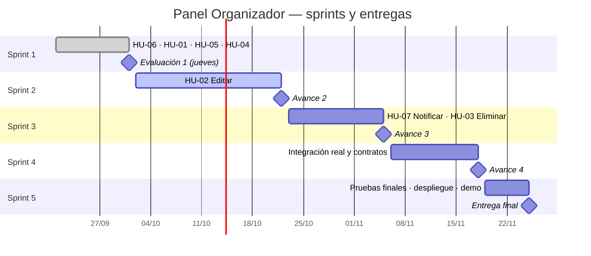

# Plan del proyecto — Panel Organizador (TicketU)

Hoja de ruta completa del microservicio, del Sprint 1 a la entrega final. Cada sprint dice **qué se construye,
quién lo lleva, qué tiene que existir en el repositorio al cerrarlo y contra qué ítem de la rúbrica se evalúa**.

> Documento vivo: se actualiza al cerrar cada sprint. Si una fecha o un alcance cambia, se cambia aquí primero
> y después en los issues/milestones de GitHub.

---

## 1. Resumen

| | |
|---|---|
| **Qué es** | Microservicio de gestión de eventos para organizadores dentro de la arquitectura de microservicios de TicketU |
| **Stack** | Node.js 26 · TypeScript · Express 5 · Zod 4 · MongoDB 8 (Mongoose 9) · React 19 + Vite · Vitest · Postman/Newman · GitHub Actions |
| **Depende de** | **Auth** (validación de sesión): el único servicio que Panel consume |
| **Lo consumen** | Catálogo, Entradas, Check-in, Notificaciones, Promociones |
| **Repositorio** | `marybaxmann/Equipo-1---Panel-Organizador` |
| **Cómo levantarlo** | Ver [`README.md`](../README.md): 6 comandos, con Docker para MongoDB y el mock de Auth |

### Arquitectura en una imagen



---

## 2. Calendario



| Sprint | Fechas | Historias / tareas | Milestone en GitHub |
|---|---|---|---|
| 1 | 21/09 → **01/10** | HU-06, HU-01, HU-05 + HU-04 adelantada ([ADR-0009](adr/0009-hu04-adelantada-al-sprint-1.md)) | Avance 1 — 01/10/2026 |
| 2 | 02/10 → **22/10** | HU-02 (+ notificación de HU-04 lista para el outbox) | Avance 2 — 22/10/2026 |
| 3 | 23/10 → **05/11** | HU-07, HU-03 | Avance 3 — 05/11/2026 |
| 4 | 06/11 → **18/11** | TASK-01 a TASK-04 (integración, contratos, pruebas, correcciones) | Avance — 18/11/2026 |
| 5 | 19/11 → **25/11** | TASK-05 a TASK-10 (pruebas finales, documentación, despliegue, presentación) | Entrega final — 25/11/2026 |

> **Fuente de verdad del sprint de cada HU: los milestones de GitHub.** `docs/sprints.md` ubicaba HU-07 en
> el Sprint 2. Se corrige: HU-07 va en el Sprint 3, junto a HU-03, porque ambas dependen del broker.

---

## 3. Roles y responsables

| Integrante | Rol en el equipo | Rol en la rúbrica (Evaluación 1) | Foco durante el proyecto |
|---|---|---|---|
| Joaquín Andrés Martínez | Backend | **Back End** (BE1–BE3) | API, reglas de negocio, cliente de Auth, publicación al broker |
| Etienne Araya | Integración | **Calidad** (CA1–CA2) | Acuerdos con otros squads, colección Postman, pruebas de contrato |
| Christopher Okinggton | QA / Base de Datos | **Base de Datos** (BD1–BD4) + Calidad | Esquema, diccionario, validadores, pruebas funcionales |
| Alonso Alejandro Vera | Frontend | **UI/UX** (UI1–UI3) | Pantallas del organizador, estándares de UI con otros módulos |
| Mariajosé Baxmann | Scrum Master | **Gestión** (GE1–GE4) | Tablero, issues, DoD, políticas, presentación |

La tabla oficial (roles, HU, tareas y contratos) está en [`RESPONSABLES.md`](../RESPONSABLES.md). Nota individual =
50 % la nota del propio rol + 50 % la grupal, así que **todos responden por todo** aunque cada uno lidere su parte.

---

## 4. Reglas de trabajo (valen para todos los sprints)

### 4.1 Git

- `main` siempre funciona. Se trabaja en ramas `feat/hu-XX-descripcion`, `fix/...` o `docs/...` y se integra **por PR** con al menos una revisión de otro integrante.
- Commits en **Conventional Commits**, en inglés (`feat:`, `fix:`, `docs:`, `test:`, `refactor:`, `chore:`).
- El PR que cierra una HU incluye `Closes #N` y **no se mergea con el CI en rojo**.
- Código y nombres en inglés. **Campos de la API y de la BD en español snake_case, idénticos a los contratos.** Comentarios y documentación en español.

### 4.2 Definition of Done (toda HU)

La DoD oficial del equipo está en [`DEFINITION_OF_DONE.md`](DEFINITION_OF_DONE.md) y es la única fuente: no se duplica aquí.
Para este repo, además, un PR que cambia la API o la BD cumple lo siguiente:
- el Swagger y el test de contrato están al día (ADR-0006);
- el schema de la BD y el diccionario están regenerados (ADR-0002);
- los casos Postman se agregaron en el generador (ADR-0010).

### 4.3 Política de autorización (toda operación del organizador)

1. La sesión se valida contra Auth (`GET /internal/validar-sesion`) reenviando la cookie `jwt` **sin decodificarla**.
2. Sólo `rol = organizador` accede al panel; otro rol → 403.
3. La identidad (`id_usuario`) sale **sólo** de la respuesta de Auth; el frontend nunca la define.
4. Sesión inválida o expirada → 401 y redirección al login.
5. Si Auth no responde en 1 s (con 1 reintento) → 503 y la operación no se ejecuta (*fail-secure*).
6. Editar, publicar, eliminar o ver el detalle exige que el evento sea del organizador → si no, 403.

### 4.4 Comandos de verificación antes de abrir un PR

```bash
npm run typecheck -w backend && npm test             # backend: tipos + tests
npm run build -w frontend && npm run lint -w frontend # frontend: build + lint
npx @redocly/cli lint docs/api/openapi.yaml           # Swagger válido
npm run test:integration                              # Postman/Newman (API + BD de demo levantadas)
```

---

## 5. Sprint 1 — Gestión básica del organizador (21/09 → 01/10)

**Objetivo:** un organizador autenticado puede crear eventos y ver los suyos; el resto de los squads ya tiene
definidos los servicios que van a consumir.

### 5.1 Historias

| HU | Resultado |
|---|---|
| **HU-06** Verificación de autorización | Cliente de Auth con timeout, 1 reintento y fail-secure. Middleware de rol. Validación de propiedad |
| **HU-01** Crear evento | `POST /api/v1/panel/eventos`: nace en BORRADOR, asociado al organizador, con validación campo a campo |
| **HU-05** Ver mis eventos | `GET /api/v1/panel/eventos/mios` (filtro por estado) y `GET /mios/{id}` (detalle con validación de propiedad) |
| **HU-04** Publicar evento *(adelantada)* | `POST /mios/{id}/publicar`: sólo Borrador → Publicado, atómica, visible de inmediato en Catálogo. Falta la notificación por broker (HU-07). Ver [ADR-0009](adr/0009-hu04-adelantada-al-sprint-1.md) |

### 5.2 Qué quedó construido

- **Backend:** API Express en TypeScript. 7 endpoints para otros squads (Catálogo ×3, Entradas, Check-in, Notificaciones, Promociones).
- **Base de datos:** colecciones `eventos` y `cambios_estado_evento` con validadores `$jsonSchema` e índices. Script de creación idempotente, seed de demo determinista (7 eventos, IDs fijos), y diagrama ER y diccionario **generados desde la BD en ejecución**.
- **Swagger:** [`openapi.yaml`](api/openapi.yaml) con las 6 HU (HU-01/04/05/06 implementadas; HU-02/03 definidas) y los 5 consumidores, más [`auth-consumido.yaml`](api/auth-consumido.yaml).
- **Frontend** (base del equipo, estándar visual acordado entre squads, [ADR-0008](adr/0008-frontend-estandar-visual-y-login-simulado.md)): login simulado, Mis eventos (tarjetas por estado, filtros con contador, buscador), publicar con confirmación, avisos de Sprint 2/3 en editar y eliminar, Nuevo evento (errores bajo cada campo), Detalle y pantallas de sesión (401/403/503).
- **Calidad:** 77 tests (Vitest), 16 pruebas de contrato OpenAPI, 16 casos Postman/Newman y CI en GitHub Actions.
- **Decisiones:** ADR-0002 a ADR-0010 en [`adr/`](adr/README.md). **Qué se hizo en el área de cada integrante:** [`guia-equipo.md`](guia-equipo.md).

### 5.3 Checklist de cierre de la Evaluación 1 (entrega: **jueves 01/10**)

| Ítem | Qué falta | Responsable |
|---|---|---|
| Código en el repo del equipo | PR desde la rama de trabajo con `Closes #1, #5, #6` (y comentario en #4, ver ADR-0009), CI en verde, merge | Joaquín |
| GE1 | Tablero GitHub Projects con campo *Sprint*; responsables en TASK-01..10 | Mariajosé |
| GE2 | Pegar **DoD** (§4.2) y **política de autorización** (§4.3) en las 7 HU | Mariajosé |
| GE3 | Tablero reflejando el estado real al cierre: HU-01/05/06 en *Hecho* | Mariajosé |
| GE4 | Issues INT-01..INT-08 ya creados en el repo de trabajo → **replicarlos en el repo de presentación** (§10) | Mariajosé + Etienne |
| RESPONSABLES.md | ✅ versión del equipo en la raíz (en el repo de presentación está en `docs/`, y su README apunta a la raíz: moverlo) | Mariajosé |
| Revisión por área | Cada integrante revisa lo hecho en su área ([`guia-equipo.md`](guia-equipo.md)) y edita o comenta | Todos |
| Presentación | Ensayo de 10 min con cronómetro (§5.5) | Mariajosé + todos |

### 5.4 Demo en vivo (el profesor no pide capturas)

La evaluación se hace mostrando la aplicación funcionando. Antes de entrar, con la app levantada: `npm run db:seed`
(deja los 7 eventos de demo) y abrir en pestañas `http://localhost:5173/login`, `http://localhost:3000/api-docs`,
`docs/bd/diagrama-er.md` en GitHub, el tablero y `docs/evidencias/`.

### 5.5 Guion de la presentación (10 min · presenta la Scrum Master)

| Minuto | Rol | Qué se muestra (lo que no se muestra vale 0) |
|---|---|---|
| 0:00–3:30 | UI/UX | Login como Org A → Mis eventos con 4 estados + filtros → Nuevo evento con errores → crear OK (Borrador) → **publicarlo** (modal) → lápiz → aviso Sprint 2 → detalle → A abre `/mis-eventos/66f1b0000000000000000001` → "no te pertenece" → avatar → login como asistente → sin permisos |
| 3:30–5:30 | Back End | Swagger: tag Organizador (HU-01/04/05/06 + HU-02/03 planificadas) y los 5 de Integración → `auth.client.ts` (cookie, timeout, reintento, fail-secure) + `auth-consumido.yaml` · opcional: Auth lento → 503 |
| 5:30–7:00 | Base de Datos | Diagrama generado desde la BD (PK, FK `id_evento`, REF a Auth) → diccionario → validador en Compass (o `db.getCollectionInfos()`) → "sólo guardamos `id_organizador`" |
| 7:00–8:45 | Gestión | Tablero por sprint · HU con responsable, CA, DoD y política · issues de integración · RESPONSABLES.md |
| 8:45–10:00 | Calidad | CI en verde + tabla CA→test · runner de Postman 16/16 · ADRs como registro de decisiones |

**Preguntas probables del profesor:** ¿por qué MongoDB si la rúbrica es relacional? · ¿por qué no decodifican el JWT? · ¿qué pasa si Auth se cae? · ¿cómo evitan guardar datos de otros squads? · ¿qué falta para integrar de verdad?

---

## 6. Sprint 2 — Editar (02/10 → 22/10)

**Objetivo:** el organizador mantiene sus eventos al día. HU-04 ya se implementó en el Sprint 1 (ADR-0009); en este sprint sólo se deja su notificación escrita en el outbox (ADR-0003).

### 6.1 HU-02 — Editar un evento

| Criterio de aceptación | Cómo se cumple |
|---|---|
| Sólo edita eventos propios | `getOwnedEvento` (ya existe) → 403 `EVENT_NOT_OWNED` |
| Modificar los datos permitidos | `PATCH /api/v1/panel/eventos/mios/{id}` con `EventoUpdate` (ya definido en Swagger): todos los campos opcionales, al menos uno |
| Validar la información | Mismo schema Zod que la creación, en versión parcial, más reglas cruzadas (fecha ≥ hoy, término > inicio, precio/tipo) |
| Guardar correctamente | Sólo BORRADOR o PUBLICADO son editables; FINALIZADO/CANCELADO → 409 |
| Informar éxito | 200 con el evento actualizado y aviso en la UI |
| Si está publicado, notificar a Catálogo | Registrar el cambio para el broker (queda listo para Sprint 3) y, mientras tanto, Catálogo lo ve en sus consultas REST |

### 6.2 HU-04 — Publicar un evento *(✅ implementada en Sprint 1, salvo el mensaje al broker)*

| Criterio de aceptación | Cómo se cumple |
|---|---|
| Sólo publica eventos propios | `getOwnedEvento` |
| Sólo BORRADOR → PUBLICADO | Transición validada; otro estado → 409 `INVALID_STATE_TRANSITION` |
| Validar información mínima (nombre, fecha, ubicación) | ✅ faltantes → 400 con `detalles` |
| Notificar a Catálogo | Registro en `cambios_estado_evento` (ya existe) + mensaje al broker en Sprint 3 |
| Un borrador no es visible en Catálogo | Ya garantizado por los endpoints de Catálogo (sólo PUBLICADO), con tests |

### 6.3 Tareas

| Tarea | Responsable | Entregable |
|---|---|---|
| Endpoint PATCH + tests (TDD, uno por CA) | Joaquín | `organizer.routes.ts`, `evento.service.ts`, tests `hu02-*` |
| Actualizar schema parcial y reglas de transición | Christopher + Joaquín | `evento.schemas.ts`, transición registrada en `cambios_estado_evento` |
| Pantalla Editar (reutiliza `NuevoEventoPage.jsx`), reemplazando el aviso del lápiz; Publicar también en el detalle | Alonso | `EditarEventoPage.jsx`, acciones en `EventoDetallePage.jsx` |
| **Cerrar con los otros squads el broker y los tópicos** (bloquea Sprint 3) | Etienne | Contratos actualizados con `panel.evento.*.v1` confirmados · ADR-0003 |
| Casos Postman de edición y publicación | Etienne + Christopher | Carpeta "08 Sprint 2" en la colección |
| Tablero, DoD en los issues, seguimiento semanal | Mariajosé | Tablero al día · minuta de acuerdos con otros squads |
| Corregir las desviaciones del estándar visual (UI3) | Alonso | Lista en `docs/ui/estandares-ui.md` |

### 6.4 Criterio de salida del Sprint 2

HU-02 cerrada por PR · Swagger sin `x-sprint: 2` en PATCH ·
tests y Postman en verde · **decisión de broker escrita** (sin esa decisión el Sprint 3 no puede empezar).

---

## 7. Sprint 3 — Notificar y eliminar (23/10 → 05/11)

**Objetivo:** los otros microservicios se enteran de cada cambio, y el organizador puede eliminar eventos.

### 7.1 HU-07 — Notificar cambios de estado

| Criterio de aceptación | Cómo se cumple |
|---|---|
| Emitir mensaje ante cualquier cambio de estado | Toda transición (crear, editar publicado, publicar, eliminar) escribe un mensaje saliente |
| Incluir id del evento, nuevo estado y fecha | Formato del contrato Notificaciones: `{ tipo, id_evento, nuevo_estado, fecha_cambio }` |
| Envío asíncrono (no bloquea al organizador) | **Patrón outbox:** la API guarda el mensaje en la colección `mensajes_salientes` y responde; un proceso aparte lo publica al broker |
| Si el destino no está disponible, registrar para reintento | El mensaje queda `PENDIENTE` con `intentos` y `ultimo_error`; se reintenta con backoff y no se pierde |
| Confirmación al organizador independiente de los otros servicios | La respuesta HTTP no espera al broker |

Cambio de BD: colección nueva `mensajes_salientes` (`_id`, `id_evento` FK, `topico`, `payload`, `estado` PENDIENTE/ENVIADO/FALLIDO,
`intentos`, `ultimo_error`, `fecha_creacion`, `fecha_envio`) con su `$jsonSchema`, índice `{estado, fecha_creacion}`, diccionario regenerado y ADR.

### 7.2 HU-03 — Eliminar un evento

| Criterio de aceptación | Cómo se cumple |
|---|---|
| Sólo elimina eventos propios | `getOwnedEvento` |
| Pedir confirmación antes de eliminar | Diálogo de confirmación en la UI (dentro de la página, no `window.confirm`) |
| Eliminado ⇒ no accesible ni visible en Catálogo | Eliminación lógica recomendada (estado o `fecha_eliminacion`) para conservar la trazabilidad; excluido de todos los endpoints |
| Notificar a Catálogo, Notificaciones y Entradas | Mensaje al outbox con `tipo: evento_eliminado` |
| (Regla a acordar con Entradas) | Si hay entradas vendidas → 409. Hay que consultar a Entradas o recibir el dato |

### 7.3 Tareas

| Tarea | Responsable |
|---|---|
| Outbox + publicador al broker + reintentos, con tests | Joaquín |
| Colección `mensajes_salientes`, schema, índices, diccionario, ADR | Christopher |
| DELETE + confirmación en UI + ocultar eliminados | Joaquín (API) · Alonso (UI) |
| Verificar con cada squad que recibe los mensajes (Catálogo, Notificaciones, Entradas, Check-in) | Etienne |
| AsyncAPI de los mensajes (`docs/api/asyncapi.yaml`) | Etienne + Joaquín |
| Tablero, issues INT al día | Mariajosé |

---

## 8. Sprint 4 — Integración real (06/11 → 18/11)

| Tarea (issue) | Qué implica | Responsable |
|---|---|---|
| TASK-01 Integración completa | Reemplazar el mock por el Auth real (`AUTH_SERVICE_URL` del ambiente de integración); conectar al broker real; probar con Catálogo/Entradas/Notificaciones | Joaquín + Etienne |
| TASK-02 Pruebas de contratos | Ampliar `contrato-openapi.test.ts` y la colección Postman contra los servicios reales; acordar datos de prueba con cada squad | Etienne |
| TASK-03 Pruebas funcionales | Recorrido completo de las 7 HU con evidencia (tests + tabla criterio → test) | Christopher |
| TASK-04 Corrección de errores de integración | Issues por error encontrado, con label `integracion` | Todos |
| Frontend | Login real con Auth (redirigir a su pantalla), sin el login simulado | Alonso |

---

## 9. Sprint 5 — Cierre (19/11 → 25/11)

| Tarea (issue) | Responsable |
|---|---|
| TASK-05 Pruebas finales · TASK-06 Correcciones finales | Christopher · todos |
| TASK-07 Documentación técnica final (README, ADRs, Swagger, AsyncAPI, diccionario) | Joaquín + Christopher |
| TASK-08 Despliegue (contenedor de API + frontend + MongoDB; variables por ambiente) | Joaquín |
| TASK-09 Validación de integración final | Etienne |
| TASK-10 Presentación final | Mariajosé + todos |

---

## 10. Dependencias con otros squads (issues de integración)

Numeración y alcance de los **issues reales** creados por Etienne (label `integracion`, repo de trabajo). **Hay que replicarlos en el repo de presentación** para GE4 (ADR-0012).

| Issue | Tema | Milestone | Estado en el código | Qué falta |
|---|---|---|---|---|
| INT-01 | Cliente de Auth, validación de sesión (fail-secure) | Avance 1 | ✅ implementado (ADR-0005) | URL real de Auth · el texto del issue tiene que decir que está implementado y usar `/api/v1/panel/eventos/mios`, no `/events/mine` |
| INT-02 | Abstracción de publicación al broker | Avance 2 | ⛔ diseño en ADR-0003 (outbox) | Implementar `EventPublisher` + `mensajes_salientes` |
| INT-03 | Integración con Catálogo | Avance 2 | 🟡 REST listo (proximos, buscar, detalle) | Mensaje `panel.evento.catalogo.v1` (tópico por confirmar) |
| INT-04 | Sincronización con Entradas / Inventario | Avance 2 | 🟡 `GET /panel/eventos/{id}` listo, **ahora con sesión** (ADR-0011) | Acordar con Entradas cómo se autentica · **quitar del issue la tarea de devolver `capacidad_*`**: choca con BD2 y ADR-0007 |
| INT-05 | Consulta de stock antes de eliminar | Avance 3 | ⛔ | Cliente del endpoint de stock de Entradas (HU-03) |
| INT-06 | Integración con Notificaciones | Avance 3 | 🟡 REST `/cambios-estado` listo | Mensaje `panel.evento.notificaciones.v1` · el contrato **v1.2** (01/10) suma `id_usuario` del organizador al mensaje, y el resultado del envío lo recibe el organizador por Notificaciones, no Panel (propuesta pendiente) |
| INT-07 | Check-in y Promociones | Avance 3 | 🟡 Check-in v1.2 alineado (ADR-0011) · Promociones `/eventos-disponibles` | Broker `panel.evento.checkin.v1` con `tipo_cambio` · mecanismo con Promociones · formato de error (propuesta §3.4) |
| INT-08 | Pruebas de contratos de integración | Avance 4 | 🟡 contrato OpenAPI + Postman listos | Probar contra los servicios reales |

La asimetría de la tabla "usuario (id, rol) → Auth (por confirmar)" no tiene issue: **agregarla a INT-01**.

---

## 11. Decisiones pendientes

| Decisión | Afecta a | Quién la destraba | Fecha límite |
|---|---|---|---|
| Tecnología de broker y nombres de tópicos | HU-02, HU-03, HU-04, HU-07 | Etienne con los squads de Catálogo, Notificaciones, Entradas y Check-in | 15/10 |
| URL del ambiente de integración de Auth | TASK-01 | Etienne con Auth | 06/11 |
| Regla de eliminación con entradas vendidas | HU-03 | Etienne con Entradas | 29/10 |
| Estándares de UI comunes entre módulos | UI3 | Alonso con los frontends de los demás squads | 15/10 |
| Revisar y aceptar los ADR 0002–0010 (hoy en estado *Propuesta*) | Todas | Cada responsable de área | 08/10 |
